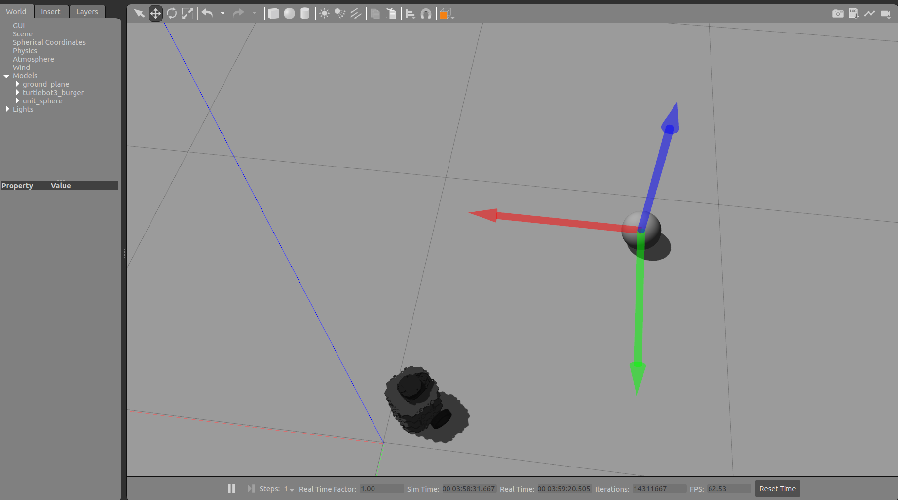

**Turtlebot Testing**

Some simple Python scripts playing around with turtlebot3 in gazebo using ROS.

Requires
* ROS (I'm using Melodic - Ubuntu 18.04)
* turtlebot3 ROS libraries
  * See: https://emanual.robotis.com/docs/en/platform/turtlebot3/quick-start/
* turtlebot3 simulation package
  * See: https://emanual.robotis.com/docs/en/platform/turtlebot3/simulation/#gazebo-simulation

**Turn North** - Turns the robot to face north (assuming this is at yaw = 0 from its odometry)

To run (in your catkin workspace):
* Terminal 1
`roslaunch turtlebot3_gazebo turtlebot3_empty_world.launch`
* Terminal 2
`rosrun turn_north turn_north.py`

**Follow Sphere** - Turns the robot to face a sphere that can be moved around in gazebo

To run:
* Terminal 1
`roslaunch turtlebot3_gazebo turtlebot3_empty_world.launch`
* In gazebo:
  * Add a sphere by clicking the sphere button (it must have the name unit_sphere - this should be the default name)
* Terminal 2
`rosrun turn_north sphere_follower.py`
* Now using the crossed-arrows move object tool, move the sphere around. The robot should turn to face it

